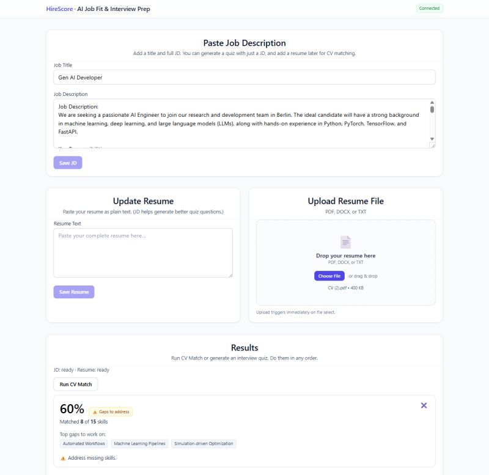
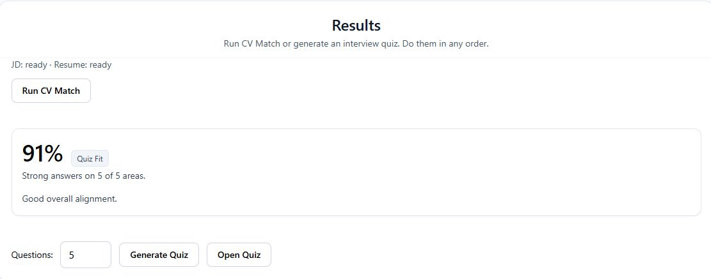
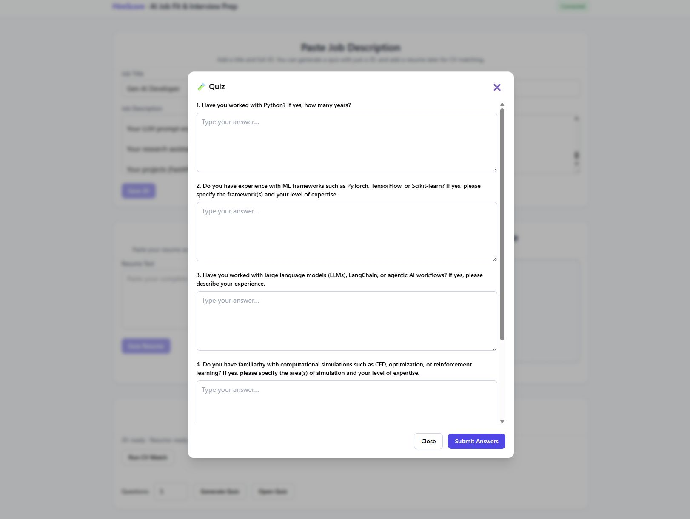

# HireScore

AI-powered job fit and interview prep tool with a React frontend and FastAPI backend. Paste a job description, upload your resume, and get:

- A resume-to-JD **match score** with concrete skill gaps
- A **self‑assessment quiz** tailored to the JD
- A combined **fit badge** summarizing where you stand

---

## Screenshots




---

## Features

- **JD ingestion**: Paste a job description, which is indexed into a Chroma vector store for later retrieval.
- **Resume ingestion**:
  - Paste raw text, or
  - Upload a file (`.pdf`, `.docx`, `.txt`) that is parsed into text.
- **CV match scoring**:
  - Extracts normalized skills from the JD via LangChain.
  - Scores your resume against those skills and surfaces gaps.
- **JD‑specific quiz generation**:
  - Generates requirement-style, self‑assessment questions focused on the skills and requirements in the JD.
  - Avoids generic / non‑JD questions where possible.
- **LLM‑based answer grading**:
  - Grades answers on relevance, qualification level, and communication.
  - Produces per‑question feedback plus an overall score.
- **Combined fit badge**:
  - Combines CV and quiz scores into a simple badge (e.g. “strong fit”, “needs work”) with guidance on how to improve.
- **Modern UI**:
  - React + Vite + Tailwind.
  - Drag‑and‑drop resume upload, toasts, modal quiz, and responsive layout.

---

## Tech Stack

- **Frontend**
  - React 18
  - Vite
  - Tailwind CSS

- **Backend**
  - FastAPI
  - SQLite via SQLModel / SQLAlchemy
  - LangChain (Ollama + HuggingFace embeddings)
  - Chroma vector store

---

## Project Structure

```text
HireScore/
  backend/
    app/
      api/
        routes_jd.py        # JD ingest endpoints
        routes_resume.py    # Resume ingest & file upload
        routes_match.py     # CV + quiz matching & badge
        routes_quiz.py      # Quiz generation & grading
      core/
        config.py           # Settings (DB URL, env)
      db/
        models.py, crud.py, session.py
      services/
        lc.py               # LangChain / Ollama / Chroma helpers
        aligner.py          # JD skill extraction & resume scoring
        quiz.py             # Question generation & grading logic
      utils/
        file.py             # Resume file parsing (PDF/DOCX/TXT)
      main.py               # FastAPI app, routes, health
    .env (optional)         # Backend config (see below)

  frontend/
    src/
      App.tsx               # Main UI and flows
      api.ts                # REST client to backend
      types.ts              # Shared response types
      index.css             # Tailwind + component styles
    .env                    # Frontend config (see below)

  requirements.txt          # Python backend deps
  1.png / 2.png / 3.png     # README screenshots (expected location)
```

---

## Prerequisites

- **Node.js** ≥ 18
- **Python** ≥ 3.10
- **Ollama** installed and running locally
  - The backend is configured to use `mistral:latest` via `ChatOllama`. Make sure you have pulled a compatible model, e.g.:
    ```bash
    ollama pull mistral
    ```
- Internet access for HuggingFace and Chroma to download models the first time.

---

## Backend Setup (FastAPI)

From the repo root:

```bash
cd backend
python -m venv .venv
source .venv/bin/activate  # On Windows: .venv\Scripts\activate
pip install -r ../requirements.txt
```

### Backend configuration

The backend uses `pydantic-settings` and reads configuration from environment variables or a `.env` file in `backend/`:

- **Database URL**
  - Env var: `DB_URL`
  - Code default (if unset): `sqlite:///./app.db` (creates a local SQLite file in `backend/`).

Example `backend/.env`:

```env
DB_URL=sqlite:///./app.db
```

You can also point this to a different SQLite file or a Postgres URL compatible with SQLAlchemy.

### Running the backend

From `backend/` with the virtualenv activated:

```bash
uvicorn app.main:app --reload --port 8000
```

Key endpoints:

- `GET /health` – health check used by the frontend.
- `POST /ingest/jd` – ingest JD (title + text), index in Chroma, returns `job_id`.
- `POST /ingest/resume` – ingest resume text, returns `resume_id`.
- `POST /ingest/resume-file` – ingest uploaded file, returns `resume_id`.
- `POST /quiz/start` – generate JD‑specific quiz questions.
- `POST /quiz/grade` – grade quiz answers and compute quiz match summary.
- `POST /match` – compute CV match, optional quiz integration, and fit badge.

On startup the app will:

- Initialize the SQLite schema (`SQLModel.metadata.create_all`).
- Use a per‑job Chroma collection under `chroma_db/job_{job_id}` for JD text chunks.

Make sure **Ollama is running** before making requests that require LangChain (JD ingest, quiz, grading, matching), otherwise those operations will fail.

---

## Frontend Setup (React + Vite)

From the repo root:

```bash
cd frontend
cp .env.example .env
```

Edit `.env` if needed:

```env
VITE_API_BASE=http://localhost:8000
```

Install dependencies and start the dev server:

```bash
npm install
npm run dev
```

By default Vite runs on `http://localhost:5173` and proxies API calls to `VITE_API_BASE`.

---

## Using HireScore Locally

1. **Start the backend**
   - `uvicorn app.main:app --reload --port 8000` from `backend/`, with Ollama running.
2. **Start the frontend**
   - `npm run dev` from `frontend/`.
3. **Open the UI**
   - Visit `http://localhost:5173` in your browser.

### Typical workflow

1. **Paste job description**
   - Enter a job title and full JD, then click **Save JD**.
2. **Add your resume**
   - Either paste resume text and **Save Resume**, or drag‑and‑drop a file in the upload card.
3. **Run CV match**
   - Once both JD and resume are saved, click **Run CV Match** to see:
     - Overall percentage match
     - Count of matched vs total JD skills
     - Top gaps to work on
4. **Generate & take quiz**
   - Set the number of questions (1–10) and click **Generate Quiz**.
   - Open the quiz modal, answer each question, and submit.
   - You’ll get an overall quiz score plus gap hints.
5. **Interpret the badge**
   - The backend combines CV and quiz scores into a simple badge like:
     - `strong_fit`, `improve_quiz`, `improve_cv`, or `needs_work`,
     - with a human‑readable message explaining what to improve.

You can reset the current session at any time via the **Reset Session** button in the footer.

---

## Notes & Troubleshooting

- **Health check failing**
  - The frontend shows `Backend Offline` if `GET /health` is not reachable or does not return `{ "status": "ok" }` or `{ "ok": true }`.
  - Verify the FastAPI server is running on the same host/port as `VITE_API_BASE`.

- **Model / LLM issues**
  - If JD indexing, quiz generation, or grading fails, confirm:
    - Ollama is running.
    - You have a compatible model pulled (`mistral:latest` by default).

- **Vector store & DB**
  - Chroma data is stored under `chroma_db/` in the backend directory.
  - The default SQLite file is `app.db` in `backend/`.
  - Deleting these will reset stored jobs, resumes, quizzes, and embeddings.

---

## License

Add your preferred license here (e.g. MIT, Apache‑2.0) if you plan to open‑source this project.

